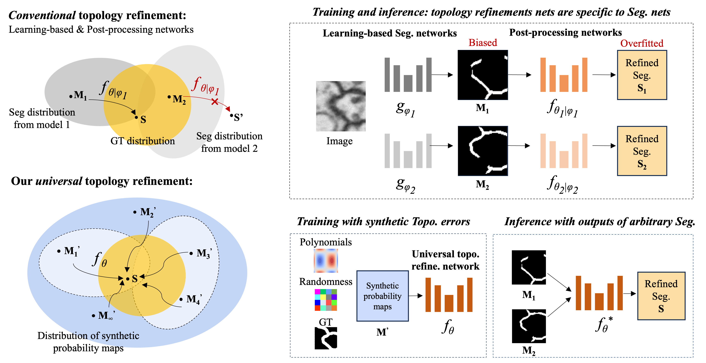

# Topology-aware Segmentation using Euler Characteristic
This is the official PyTorch implementation for the paper: Universal Topology Refinement for Medical Image Segmentation with Polynomial Feature Synthesis, which is accepted in [MICCAI 2024](https://conferences.miccai.org/2024/en/).

Liu Li, Hanchun Wang, Matthew Baugh, Qiang Ma, Weitong Zhang, Cheng Ouyang, Daniel Rueckert, and Bernhard Kainz.

## Overview

In this paper, we proposed a versatile plug-and-play **topology refinement method** that is compatible with any domain-specific segmentation pipelines.

Given a dataset with segmentation ground truth (GT), we learn the topological priors directly from the GT in a self-supervised manner. This is achieved by randomly interpolating the GT and training a topology refinement network to recover the segmentation. Our post-processing style refinement network operates independently of the upstream segmentation performance, thus agnostic to covariate (domain) shifts.

We support both 2D and 3D topological interpolations with chebyshev, hermite and legendre polynomials.

This repository is build on top of the repository of our previous work: [Euler-characteristic-based topology refinement](https://github.com/smilell/Topology-aware-Segmentation-using-Euler-Characteristic)


## Dataset
In our paper, the segmentation performance is evaluated on the 3D [ToP-CoW](https://topcow23.grand-challenge.org/) datasets.


## Pipeline



## Polynomial perturbation
You can directly mask on a GT labelmap with polynomial basises by running the following lines in python:
```
from polynomial import Polynomial, random_mask
# Create a Polynomial object (only needs to be done once)
poly = Polynomial(map_size=64, order=12, dim=2, basis_type='chebyshev')

# Get the masked labelmap
labelmap_onehot_masked, mask, label_skel = random_mask(labelmap_onehot, map_size, inpaint_type, poly, order)
```

### Parameters
`labelmap_onehot` (torch.array): The input binary one-hot encoded labelmap. For a 2D image, the labelmap_onehot in the shape of [batch, 1, x, y]

`map_size` (int): The size of the polynomial mask

`inpaint_type` (str): The type of inpainting
- Choice: 'polynomial', 'polynomial_bi', 'polynomial_bi_binary', 'polynomial_gauss', 'polynomial_gauss_binary', 'polynomial_binary'

`poly`: The object of the Polynomial class

`order` (int): The order of the polynomial basis

### Return 
`labelmap_onehot_masked` (torch.array): Masked labelmap 

`mask` (torch.array): The mask that highlight where

`label_skel` (torch.array): The skeleten of the labelmap
(examples of CREMI dataset saved in `figure/`)

## Train a new network
Optionally, you can train a new U-Net-based topology-refinement network by:

### Training
    ```
    --phase train_post_manualmask --TBout ./output_1/poly_1/ --model ./model_1/poly_1/ --inpaint_type polynomial_gauss --basis_type chebyshev --order 6 --istest --mode3d
    ```

    `--TBout` The directory to save tensorboard output files
    
    `--model` The directory to save trained model parameters
    
    `--polynomial_gauss` The type of interpolation
    
    `--basis_type` and `--order` The args to control polynomical basis and order
    
    `--mode3d` Specify if the dataset is 3D
    
    `--test_synthetic_sample` if activate, it will also test on the synthetic data (to validate overfitting or not); if False, it will test use the data from either `--val_softmax` or `--test_softmax` depending on if its during validation or test phase.

Please also change the args of image and segmentation directory in main.py, and their dataloader accordingly.
    
### Test
Given the segmentation predictions from a trained network, the topology refinement result can be obtained by running:
    
    ```
    python main.py --phase test_post --trained_model_post ./model_1/poly_1/ --out ./output_1/poly_1/ --TBout./output_1/poly_1/ --test_softmax ./data/cremi_2d/test/softmax/
    ```
    
    `--trained_model_post` The directory to load the trained topology refinement network
    `--test_softmax` The directory to load the segmentation prediction as the input of the refinement network


## Installation
This repo is build based on [PyTorch](https://pytorch.org/) and [GUDHI](https://gudhi.inria.fr/) (for topology calculation) libraries. The dependencies can be installed by running the following codes. Note that the PyTorch version is chosen by my GPU (NVIDIA GeForce RTX 3080) and cuda version. Please check if this setting also works for your environment from [PyTorch documents](https://pytorch.org/get-started/previous-versions/).

```
conda create --name euler-segmentation python=3.6
conda activate euler-segmentation
pip install torch==1.8.0+cu111 torchvision==0.9.0+cu111 -f https://download.pytorch.org/whl/torch_stable.html
pip install -r requirements.txt 
pip install -U git+https://github.com/shizuo-kaji/CubicalRipser_3dim
```

## Contact
If you have any questions, please feel free to email liu.li20@imperial.ac.uk


